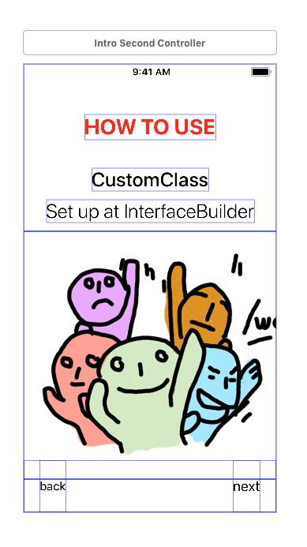
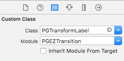
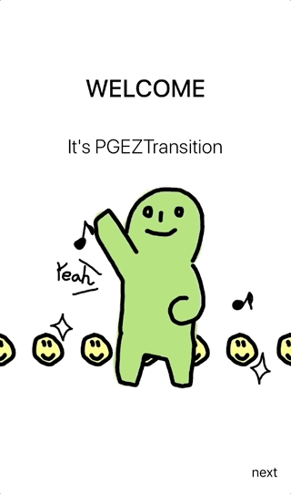

# PGEZTransition

[](https://travis-ci.org/ipagong/PGEZTransition)
[](https://cocoapods.org/pods/PGEZTransition)
[](https://cocoapods.org/pods/PGEZTransition)
[](https://cocoapods.org/pods/PGEZTransition)

## Example

To run the example project, clone the repo, and run `pod install` from the Example directory first.


it's viewcontroller transitioning with protocol.

you need to use views that realized the protocol. (PGTransformal)

## Requirements

above
- swift 4.0    
- xCode 9.3

## Installation

PGEZTransition is available through [CocoaPods](https://cocoapods.org).   
To install it, simply add the following line to your Podfile:

```ruby
pod 'PGEZTransition'
```

## How to Use

1. Setup views on interfacebuild (or programatically)

<p align="left">

</p>

2. Setup custom class at "inspector"  (if you use UILabel, use PGTransformLabel)

<p align="left">

</p>

3. Setup transform value & alpha

```swift
class IntroSecondController: UIViewController {
    
    //connect IBOutlet
    @IBOutlet weak var titleTop: PGTransformLabel!
    
    override func viewDidLoad() {
        super.viewDidLoad()
    
        // Setup view transform.
        titleTop
            .setStartTransform(.y(15), start: 0.3, duration: 0.4)
            .setStartAlpha(0.0, start: 0.2, duration: 0.4)
            .setEndTransform(.zero, start: 0.0, duration: 1.0)
            .setEndAlpha(1.0, start: 0.0, duration: 1.0)
            
        ...
    }
}
```

4. Connect Each ViewController ( target vc < - > will present vc )

```swift

class IntroFirstController: UIViewController {
    //Animator
    private var transition:PGTransformTransition!
    
    //next view controller 
    private lazy var nextVc:IntroSecondController = {
        return UIStoryboard.init(name: "Main", bundle: nil).instantiateViewController(withIdentifier: "IntroSecondController") as! IntroSecondController
    } ()
    
    override func viewDidLoad() {
        super.viewDidLoad()
        
        //setup
        self.transition = PGTransformTransition(target: self, presenting: self.nextVc)
    }
}
```

# Demo  

<p align="center">

</p>

appetize.io demo : [\[ here \]](https://appetize.io/app/mq2yv6204y32pfjj8eqca2zpa8?device=iphone6s&scale=75&orientation=portrait&osVersion=11.4) 

## Author

suwan.park, ipagong.dev@gmail.com

## License

PGEZTransition is available under the MIT license. See the LICENSE file for more info.
